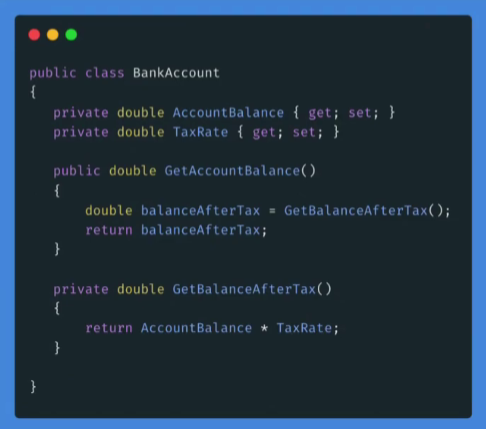

# Encapsulación

Encapsular significa ocultar o cubrir.

**Modificares de acceso**

En C#, la encapsulación se logra mediante modificadores de acceso: **Public , Private, Protected, Internal, Protected-Internal y private-protected**.

+ Encapsulación es básicamente tener el control de una clase, accediendo desde otras clases de manera específica. 
+ Sirve para encapsular lógica de programación, lo cual es una práctica fundamental cuando se trabaja con proyectos profesionales.
+ Permite colocar restricciones y no modificar bloques de código importantes.
+ Gestiona la visibilidad y el acceso de ciertas propiedades y métodos de una clase.  

