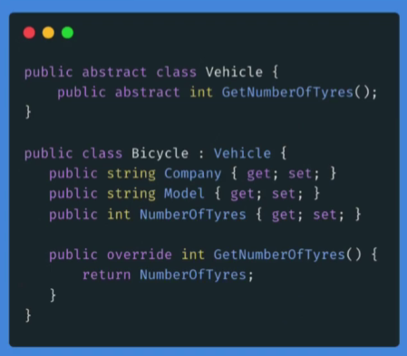

# Abastracción

Significa que no tiene una instancia en la realidad, pero existe como idea.
Es algo que no tiene una implementación real, pero que existe como idea.

**Clase abstracta**  

Son clases que no tienen **instancias**; se pueden implementar, pero, las clases que se implementan, también implementarán las propiedades y métodos que contienen.

En otras palabras, una clase abstracta no esta hecha para instanciar objetos, sino para ser el padre de varias clases hijas por medio de la herencia. Mismas que obtienen propiedades en común.  

  

### Consideraciones  

+ Implementar una clase abstracta funciona igual que una herencia, agregando que, debemos hacer una reescritura(override) de las propiedades y métodos de esa clase. 

```c#
    public abstract class Vehicle
    {
        public abstract int GetNumberOfTyres();
    }
```

La clase anterior no tiene una implementación, tiene un método o más bien una **sentencia que tiene forma de método**. Cuando lo implementamos en una clase, le damos forma definida. No una única forma, una clase abstracta puede tomar múltiples formas, dependiedo de las necesidades del programador. Ejemplos:

+ Clase Bicycle que implementa la clase abstracta:  
    ```c#
    public class Bicycle : Vehicle 
    {
        public string Company { get; set; } = "";
        public string Model { get; set; } = "";
        public int NumberOfTyres { get; set; }

        public override int GetNumberOfTyres() // Reescritura del método de la clase abstracta Vehicle{}, primera implementación
        {
            return NumberOfTyres;
        }   
    }
    ```  

+ Clase Car que implementa la clase abstracta:  
    ```c#
    public class Car : Vehicle
    {
        public string Company { get; set; } = "";
        public string Model { get; set; } = "";
        public int FrontTyres { get; set; }
        public int BackTyres { get; set; }

        public override int GetNumberOfTyres() // Otra implementación del método abstracto de la clase Vehicle{}
        {
            return FrontTyres + BackTyres;
        }
    }
    ```


